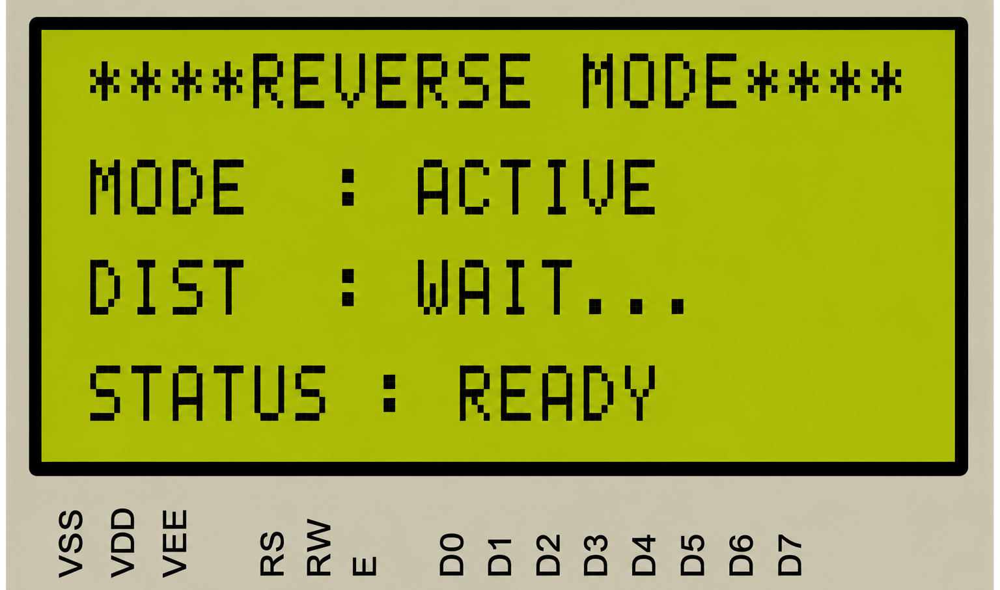
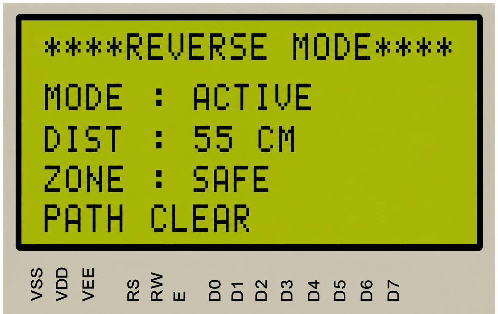
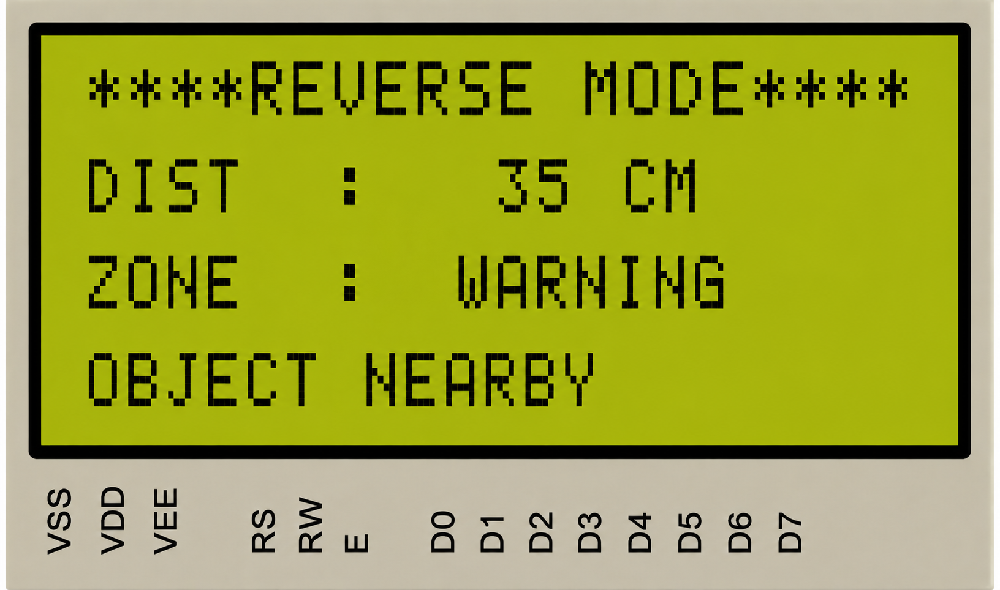
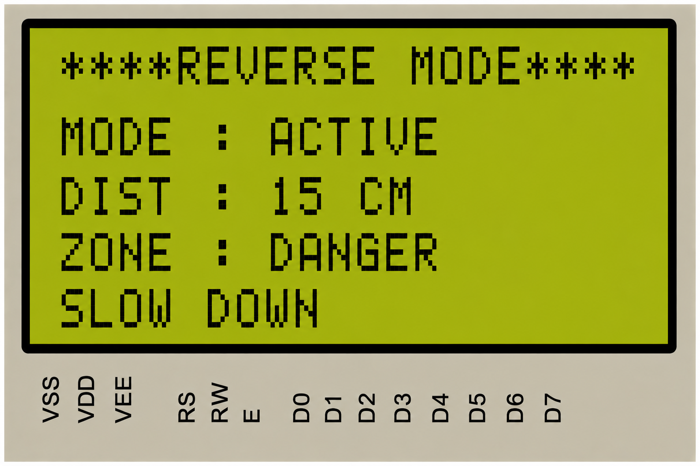
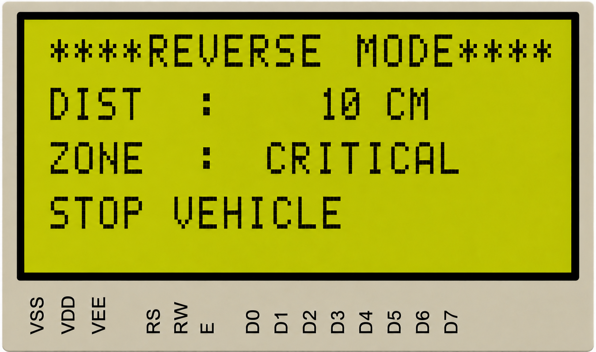

# 🚗 CAN-Based Engine Monitoring and Vehicle Control System

<p align="center">


</p>

---

# 📖 Table of Contents

- 📌 Project Overview
- 🎯 Objectives
- 🖼 Block Diagram
- 🏗 System Architecture
- ⚙ Hardware Requirements
- 💻 Software Requirements
- 📂 Repository Structure
- 📨 CAN Message IDs
- 🚀 Features
- 🖥 LCD Output Gallery
- ▶ Build Instructions
- 📈 Future Enhancements
- 👨‍💻 Author

<br>

---

# 📌 Project Overview

This project implements a **distributed automotive embedded system** using **three LPC2129 ARM7 nodes** interconnected over a **Controller Area Network (CAN)**.

The system continuously monitors engine temperature, controls power window movement, and provides reverse obstacle detection using a **Sharp GP2D12 IR Distance Sensor**. The latest version also incorporates **automatic CAN node monitoring**, enabling the Main Node to detect disconnected Window and Reverse nodes, display fault messages on the LCD, and safely recover to the dashboard without restarting the system.

<br>

---

# 🎯 Objectives

- Engine temperature monitoring
- CAN based multi-node communication
- Power window control
- Reverse obstacle detection
- LCD dashboard
- Real-time warnings
- Error Node Handling

<br>

---

# 🖼 Block Diagram

<p align="center">
    
</p>

<br>

---

# ⭐ New Feature — Intelligent CAN Node Failure Detection

One of the major enhancements implemented in this project is **real-time CAN Node Failure Detection and Recovery**.

Unlike a conventional CAN demo where disconnected nodes simply stop responding, this system continuously monitors the availability of each distributed node and immediately informs the driver whenever a node becomes unavailable.

The Main Node monitors communication from:

- 🪟 Window Glass Control Node
- 🚧 Reverse Alert Node

If any node is disconnected (CANH/CANL wiring removed or node powered OFF), the system automatically:

- Detects loss of CAN communication
- Displays a dedicated LCD error message
- Waits for a short timeout to avoid false detection
- Returns automatically to the dashboard after displaying the warning
- Prevents the system from hanging or freezing
- Continues monitoring the remaining healthy CAN nodes

This feature significantly improves the **robustness**, **fault tolerance**, and **user experience** of the embedded CAN network.

---

### Error Detection Workflow ⚠️

<p align="center">

</p>

---

### Advantages

- Real-time node health monitoring
- Automatic fault detection
- Automatic recovery
- No firmware restart required
- Improved CAN network reliability
- Better driver feedback

<br>


---

# 🏗 System Architecture

| Node | Function |
|------|----------|
| 🚗 Main Node | Dashboard, DS18B20, LCD, CAN Master |
| 🪟 Window Glass Control Node | Window LEDs simulation |
| 🚧 Reverse Alert Node | GP2D12 IR sensor + ADC |

<br>

---

# ⚙ Hardware Requirements

| Hardware | Quantity | Purpose |
|-----------|---------:|---------|
| LPC2129 | 3 | Controller |
| MCP2551 | 3 | CAN Transceiver |
| DS18B20 | 1 | Temperature Sensor |
| GP2D12 IR Sensor | 1 | Distance Measurement |
| 20x4 LCD | 1 | Dashboard |
| LEDs | 8 | Window Position |
| Push Buttons | 3 | Mode Selection and Window Control |
| Buzzer | 1 | Critical Alert |
| CAN Bus | 1 | Communication |

<br>

---

# 💻 Software Requirements

| Software | Purpose |
|----------|---------|
| Keil uVision | Development |
| Embedded C | Programming |
| Flash Magic | Programming LPC2129 |
| Proteus | Simulation |
| Git | Version Control |

<br>

---

# 📂 Repository Structure

```text
CAN-Based-Engine-Monitoring-and-Vehicle-Control-System
│
├── Main_Node
|   ├── Images
│   ├── CAN.c
│   ├── CAN.h
│   ├── CAN_defines.h
│   ├── dashboard.c
│   ├── dashboard.h
│   ├── delays.c
│   ├── delays.h
│   ├── DS18B20.c
│   ├── DS18B20.h
│   ├── EINT.c
│   ├── EINT.h
│   ├── LCD_functions.c
│   ├── LCD.h
│   ├── MAIN_NODE.c
│   ├── project_functions.c
│   ├── pro_funcs.h
│   ├── Startup.s
│   └── types.h
│
├── Window_glass_control_Node
|   ├── Images
│   ├── CAN.c
│   ├── CAN.h
│   ├── CAN_Defines.h
│   ├── delays.c
│   ├── delays.h
│   ├── window_control.c
│   ├── window_control.h
│   ├── MAIN_WINDOW_NODE.c
│   ├── Startup.s
│   └── types.h
│
├── Reverse_alert_node
|   ├── Images
│   ├── adc.c
│   ├── adc.h
│   ├── adc_defines.h
│   ├── CAN.c
│   ├── CAN.h
│   ├── CAN_Defines.h
│   ├── delays.c
│   ├── delays.h
│   ├── distance_sensor.c
│   ├── distance_sensor.h
│   ├── MAIN_REVERSE_ALERT_NODE.c
│   ├── Startup.s
│   └── types.h
│
├── Documentation
|    └── Images
├── README.md
└── LICENSE
```

<br>

---

# 📨 CAN Message IDs

| CAN ID | Description |
|---------|-------------|
|0x101|Window Control|
|0x102|Reverse Enable|
|0x103|Distance Data|

<br>

---

# 🚀 Features

- ✅ Distributed 3-Node CAN Architecture
- ✅ Engine Temperature Monitoring
- ✅ Normal / Warming / High / Critical Alerts
- ✅ Power Window Control
- ✅ Reverse Obstacle Detection
- ✅ Real-time LCD Dashboard
- ✅ Active Warning System
- ✅ Automatic CAN Node Failure Detection ⭐
- ✅ Window Node Error Detection
- ✅ Reverse Node Error Detection
- ✅ Automatic Dashboard Recovery
- ✅ Fault-Tolerant CAN Communication
- ✅ Modular Embedded Software Architecture

<br>

---

# 🖥 LCD Output Gallery

# 🖥️ Main Node

> 📸 The following screenshots demonstrate the different LCD screens displayed by the **Main Node** during system initialization, engine monitoring, and safety alert conditions.


<table align="center">

<tr>
<th align="center">🚀 System Initialization</th>
<th align="center">🌡️ Normal Engine Temperature</th>
</tr>

<tr>
<td align="center">


</td>

<td align="center">


</td>
</tr>

<tr>
<th align="center">⚠️ High Temperature Warning</th>
<th align="center">🔥 High Temperature Status</th>
</tr>

<tr>
<td align="center">


</td>

<td align="center">


</td>
</tr>

<tr>
<th colspan="2" align="center">🚨 Critical Overheat Alert</th>
</tr>

<tr>
<td colspan="2" align="center">

<br>
<b>Immediate 👨‍✈️Driver Warning Screen</b>
</td>
</tr>

</table>
<br>

---

# 🪟 Window Glass Control Node

> 📸 The following screenshots demonstrate the LCD screens displayed by the **Window Glass Control Node** during window opening and window closing operations.


<table align="center">

<tr>
<th align="center">⬆️ Window Opening Mode</th>
<th align="center">⬇️ Window Closing Mode</th>
</tr>

<tr>

<td align="center" valign="top">

<b>🪟 Window Opening Animation</b>
</td>

<td align="center" valign="top">

<b>🔒 Window Closing Animation</b>
</td>

</tr>

</table>
<br>

---

# 🚧 Reverse Alert Node

> 📸 The following screenshots demonstrate the LCD screens displayed by the **Reverse Alert Node** while monitoring the rear obstacle distance using the **GP2D12 IR Distance Sensor**. The displayed information changes dynamically based on the detected obstacle distance.


<table align="center">

<tr>
<th align="center">🚗 Reverse Mode Initialization</th>
<th align="center">🟢 Safe Zone</th>
</tr>

<tr>

<td align="center" valign="top">


</td>

<td align="center" valign="top">


</td>

</tr>

<tr>
<th align="center">🟡 Warning Zone</th>
<th align="center">🟠 Danger Zone</th>
</tr>

<tr>

<td align="center" valign="top">

</td>

<td align="center" valign="top">

</td>

</tr>

<tr>
<th colspan="2" align="center">🔴 Critical Zone Alert</th>
</tr>

<tr>

<td colspan="2" align="center">

<div align="center">
  <b>🔴 Immediate Stop Vehicle (6 cm)</b>
</div>
</td>

</tr>

</table>

<br>

---

# 🚨 CAN Node Failure Detection

> 📸 The following LCD screens demonstrate the intelligent fault detection mechanism implemented in the Main Node. Whenever any CAN node becomes unavailable, the system automatically detects the communication timeout, displays an informative error message, and safely returns to the dashboard.

<table align="center">

<tr>
<th align="center">🪟 Window Node Failure</th>
<th align="center">🚧 Reverse Node Failure</th>
</tr>

<tr>

<td align="center">

<br>

</td>

<td align="center">

<br>

</td>

</tr>

</table>


## 🛡 Fault Detection Workflow

```text
        🚀 User Action
             │
             ▼
     📤 Transmit CAN Frame
             │
             ▼
   🔍 Monitor CAN Response
             │
      ┌──────┴───────┐
      │              │
      ▼              ▼
🟢 Frame Received   🔴 No Response
      │              │
      ▼              ▼
Continue Mode    ⏱ Timeout Counter
                     │
                     ▼
          📟 LCD Error Notification
                     │
                     ▼
           🏠 Return to Dashboard
                     │
                     ▼
        🔄 Resume Normal Operation
```

---


# ▶ Build Instructions

1. Open each node project in Keil uVision.
2. Build project.
3. Flash LPC2129 using Flash Magic.
4. Connect all three CAN nodes.
5. Power ON.
6. Observe LCD and CAN communication.

<br>

---

# 📈 Future Enhancements

- CAN Bus-Off Detection
- CAN Error Passive Monitoring
- Automatic Node Reconnection Detection
- CAN Interrupt Driven Communication
- Diagnostic Trouble Codes (DTC)
- CAN Logger
- FreeRTOS Migration

<br>

---

# 👨‍💻 Author

**Yeswanth Gunisetty**

Embedded Systems | Embedded C | ARM7 | CAN | Linux Internals | DSA
